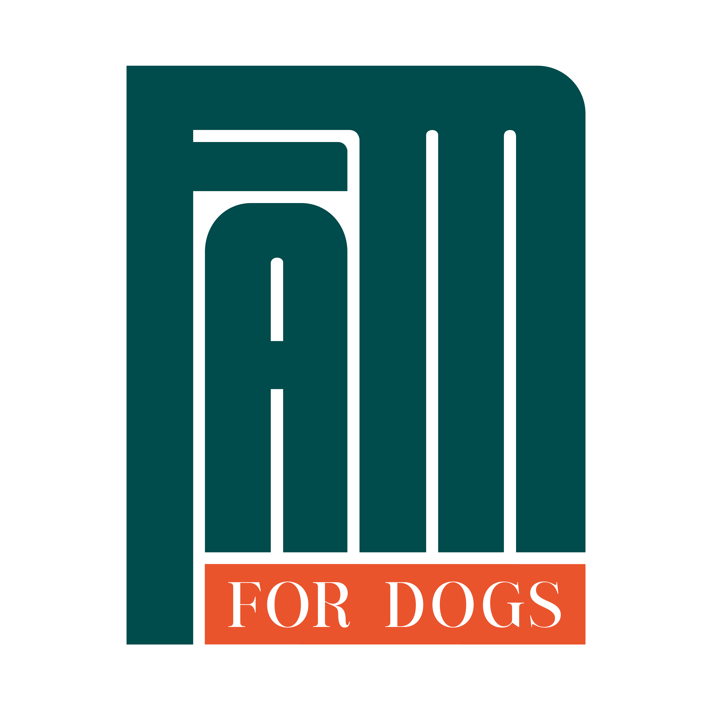

# FAM for Dogs e.V. Website

## Über das Projekt

FAM for Dogs e.V. (Fight and Movement for Dogs) ist ein Tierschutzverein, der ursprünglich von Mieke und Fiona gegründet wurde und sich für Straßenhunde in Indonesien und Rumänien einsetzt.

Ich habe das Projekt erstmals über Instagram entdeckt. Die Arbeit von Fiona und Mieke hat mich so beeindruckt, dass ich Fiona direkt angeschrieben und angeboten habe, eine professionelle Webpräsenz für den Verein zu gestalten. Aus diesem ersten Kontakt entstand eine enge, kreative Zusammenarbeit, die ich später im Rahmen meines 6. Semesters an der Hochschule Bremerhaven weiter ausgebaut habe.

Mir war es wichtig, mit modernen Webtechnologien einen echten Mehrwert für den Verein und den Tierschutz zu schaffen. Die Seite soll als digitales Schaufenster für die wichtige Arbeit des Vereins dienen, Menschen informieren, emotional berühren und zu Spenden oder Patenschaften motivieren. Die Zusammenarbeit war für mich nicht nur ein technisches, sondern auch ein soziales Herzensprojekt.

Die Webseite dient als digitales Schaufenster für die wichtige Arbeit des Vereins und soll Besucher informieren, engagieren und zu Spenden oder Patenschaften motivieren. Durch eine emotionale und authentische Darstellung der Tierschutzarbeit wird eine starke Verbindung zu potenziellen Unterstützern hergestellt.

## Technologie-Stack

Dieses Projekt wurde mit folgenden Technologien entwickelt:

- **Frontend Framework**: React 18 mit funktionalen Komponenten und Hooks (useState, useEffect, useRef, useContext)
- **Entwicklungsumgebung**: Vite für schnelle Entwicklung und optimierte Builds
- **Styling**: 
  - Tailwind CSS für responsive und konsistente Gestaltung
  - Custom CSS für spezifische Animationen und Effekte
  - CSS-in-JS für komponentenspezifische Styles
- **Programmiersprache**: TypeScript für typsichere Entwicklung und bessere Code-Qualität
- **Routing**: React Router v6 mit browserHistory für dynamische Seitennavigation
- **State Management**: Context API für globalen Zustand (z.B. Anzeigesprache, Thema)
- **Icons**: Lucide React für konsistente und skalierbare Icons
- **Animation**: 
  - CSS Transitions und React useRef Hooks für performante UI-Animationen
  - Intersection Observer API für Scroll-Animationen
- **Bildoptimierung**: 
  - React Lazy Loading für verbesserte Ladezeiten
  - Responsive Images mit srcset für unterschiedliche Bildschirmgrößen
  - WebP-Format für optimierte Dateigröße
- **Deployment**: 
  - GitHub Pages / Netlify für kontinuierliche Bereitstellung
  - Automatisierte Build-Prozesse mit GitHub Actions

## Projektstruktur

Das Projekt folgt einer modularen Struktur mit einem Fokus auf Wiederverwendbarkeit und Wartbarkeit:

- `src/components/`: Wiederverwendbare UI-Komponenten
  - `src/components/common/`: Grundlegende UI-Elemente (Buttons, Cards, etc.)
  - `src/components/layout/`: Layout-Komponenten (Header, Footer, Navigation, etc.)
  - `src/components/forms/`: Formular-Komponenten und Validierungslogik
  - `src/components/sections/`: Komplexe Abschnitte, die auf mehreren Seiten verwendet werden
- `src/pages/`: Seitenkomponenten für das Routing
  - `src/pages/home/`: Komponenten speziell für die Startseite
  - `src/pages/about/`: Über-uns-Seite mit Team-Informationen
  - `src/pages/dogs/`: Komponenten für die Darstellung der Hunde-Profile
- `src/pages/projects/`: Detailseiten für verschiedene Projekte
  - Einzelne Dateien für jedes Projekt mit eigener Logik und Layout
- `src/hooks/`: Custom React Hooks für wiederverwendbare Logik
- `src/utils/`: Hilfsfunktionen und Utilities
- `src/types/`: TypeScript-Typdefinitionen
- `src/assets/`: Interne Assets wie SVGs, Fonts, etc.
- `public/`: Statische Assets wie Bilder und Videos
  - `public/images/`: Organisiert nach Kategorien (team, dogs, projects, etc.)
  - `public/videos/`: Video-Material für die Webseite

## Technische Implementierungsdetails

### Responsive Design-System
Die Webseite verwendet ein ausgeklügeltes Breakpoint-System, das auf den gängigsten Bildschirmgrößen basiert:
- Mobile: < 640px
- Tablet: 640px - 1024px
- Desktop: > 1024px

Tailwind-Klassen werden konsistent mit Präfixen verwendet (sm:, md:, lg:), um ein einheitliches responsives Verhalten zu gewährleisten.

### Barrierefreiheit
Die Webseite wurde mit Fokus auf Barrierefreiheit entwickelt:
- Semantisches HTML5
- Angemessene Kontrastverhältnisse für Text
- Alt-Texte für alle Bilder
- Aria-Labels für interaktive Elemente
- Tastaturfokus-Management für Navigation ohne Maus

### Performance-Optimierung
- Code-Splitting auf Routenebene für schnellere initiale Ladezeiten
- Lazy Loading für Bilder und nicht-kritische Komponenten
- Optimierte Asset-Größen und -Formate
- Effiziente Bundle-Größe durch Tree-Shaking und Minifizierung

### SEO-Optimierung
- Dynamische Meta-Tags für jede Seite
- Strukturierte Daten (JSON-LD) für verbesserte Suchmaschinen-Darstellung
- Optimierte URL-Struktur
- Sitemap.xml für effizientes Crawling

## Herausforderungen und Lösungen

Während der Entwicklung mussten verschiedene Herausforderungen gemeistert werden:

1. **Responsive Design**: Die Webseite musste auf allen Geräten optimal dargestellt werden
   - **Problem**: Komplexe Layouts wie die Projekt-Galerien und Team-Cards mussten auf allen Bildschirmgrößen gut aussehen.
   - **Lösung**: Implementierung eines Flexbox- und Grid-basierten Layouts mit präzisen Breakpoints und einer "Mobile-First"-Entwicklungsstrategie. Verwendung von Tailwind's responsive Modifier für konsistente Anpassungen.

2. **Bildoptimierung**: Aufgrund der vielen Bilder von Hunden und Projekten war die Optimierung der Ladezeiten entscheidend
   - **Problem**: Hochauflösende Bilder führten zu langsamen Ladezeiten und hohem Datenverbrauch.
   - **Lösung**: Implementierung eines progressiven Bild-Ladesystems mit Lazy Loading, Bildkompression, WebP-Format und responsive Image-Sets. Verwendung von Bild-Platzhaltern während des Ladens.

3. **Konsistentes Styling**: Um ein einheitliches Design zu gewährleisten, wurde eine benutzerdefinierte Farbpalette und Typografie implementiert
   - **Problem**: Bei einem umfangreichen Projekt wie diesem bestand die Herausforderung, ein durchgängig einheitliches Design über alle Komponenten hinweg zu gewährleisten.
   - **Lösung**: Erstellung eines zentralen Tailwind-Themes mit benutzerdefinierten Variablen für Farben, Abstände, Rundungen und Typografie. Entwicklung einer Komponentenbibliothek für wiederkehrende UI-Elemente.

4. **Mehrsprachigkeit**: Die Webseite ist aktuell in Deutsch verfügbar, wurde aber mit einer Struktur entwickelt, die eine einfache Erweiterung um weitere Sprachen ermöglicht
   - **Problem**: Texte waren ursprünglich hart codiert, was Übersetzungen erschwerte.
   - **Lösung**: Implementierung eines i18n-Systems mit Schlüssel-Wert-Paaren für alle Texte. Trennung von Inhalten und Präsentation für einfache Erweiterbarkeit.

5. **Performance-Optimierung**: Durch Code-Splitting und optimierte Builds konnte die Ladezeit der Seite deutlich verbessert werden
   - **Problem**: Initial große Bundle-Größe und langsame Ladezeiten, besonders auf mobilen Geräten.
   - **Lösung**: Implementierung von dynamischem Import für Routen, Optimierung von Drittanbieter-Bibliotheken, Vite's Tree-Shaking und aggressive Browser-Caching-Strategien.

6. **Komplexe Bildergalerien**: Die Darstellung von Projektbildern erforderte eine flexible und leistungsstarke Galerie
   - **Problem**: Unterschiedliche Bildformate und -größen, komplexe Benutzerinteraktionen für Zoom und Navigation.
   - **Lösung**: Entwicklung einer benutzerdefinierten Galerie-Komponente mit CSS Grid für das Layout und einer optimierten Lightbox für die Vollbildansicht.

7. **Navigation und Routing**: Eine intuitive Navigation zwischen verschiedenen Sektionen war wichtig für die Benutzerfreundlichkeit
   - **Problem**: Komplexe Verschachtelung von Routen und Unterseiten, besonders für Projekte und Hundeprofile.
   - **Lösung**: Implementierung einer hierarchischen Routing-Struktur mit React Router, Breadcrumbs für die Navigation und einer benutzerfreundlichen Zurück-Funktion.

## Features

- **Mobile-responsive Design** für alle Geräte optimiert, mit besonderen Anpassungen für Touchscreen-Interaktionen
- **Detaillierte Informationen über die Rettungsmission** mit interaktiven Zeitleisten und Meilensteinen
- **Vorstellung der Hunde für Patenschaften** mit individuellen Profilen, Charaktereigenschaften und Geschichten
- **Interaktive Projekt-Karten** mit Hover-Effekten und Animationen
- **Informationen über verschiedene Projekte** mit detaillierten Beschreibungen, Bildern und Erfolgsgeschichten
- **Team-Vorstellung** mit Bildern, Biografien und Zuständigkeitsbereichen
- **Interaktive Bildergalerien** für Projekte und Aktivitäten mit Zoom-Funktion
- **Ausführliche Projektseiten** mit Bildergalerien, Statistiken und Fortschrittsberichten
- **Dynamischer Hero-Bereich** mit wechselnden Hintergrundbildern und Call-to-Actions
- **Nahtlose Integration** von Spendenmöglichkeiten und Patenschaftsanträgen
- **Kontaktformular** mit Validierung und automatischen Benachrichtigungen
- **Social Media Integration** für einfaches Teilen von Inhalten
- **Dynamische Navigationsmenüs** mit Dropdown-Funktionen für komplexe Seitenstrukturen
- **Animierte Übergänge** zwischen Seitenabschnitten für ein flüssiges Benutzererlebnis

## Besonderheiten

- **Interaktive Karten**: Visualisierung der internationalen Projekte mit Markern und Popup-Informationen zu jedem Standort. Besucher können zwischen verschiedenen Regionen wechseln und detaillierte Informationen abrufen.

- **Hunde-Profil-System**: Detaillierte Seiten für jeden Hund mit personalisierten Galerien, Videos und Geschichten. Ein benutzerfreundliches Filtersystem ermöglicht die Suche nach Alter, Größe, Geschlecht und besonderen Bedürfnissen.

- **Benutzerdefinierte Animations-Effekte**: Für eine lebendige Benutzeroberfläche wurden maßgeschneiderte Animationen entwickelt, die auf dem Scroll-Verhalten und den Benutzerinteraktionen basieren. Parallax-Effekte und sanfte Übergänge zwischen den Elementen sorgen für ein ansprechendes visuelles Erlebnis.

- **Innovative Content-Präsentation**: Informationen werden durch eine Kombination aus Text, Bildern, Videos und interaktiven Elementen präsentiert, um eine emotionale Verbindung zu den Besuchern herzustellen.

- **Optimierte Navigationsstruktur**: Für eine intuitive Benutzererfahrung wurden kontextsensitive Menüs, Breadcrumbs und intelligente Zurück-Funktionen implementiert. Die Navigation passt sich dynamisch an den aktuellen Kontext des Benutzers an.

- **Engagement-Förderung**: Strategisch platzierte Call-to-Actions, emotionale Geschichten und direkte Wege zur Unterstützung fördern die Interaktion mit den Besuchern und erhöhen die Conversion-Rate für Spenden und Patenschaften.

- **Modulares Content-Management**: Die Webseite wurde mit einer flexiblen Struktur entwickelt, die einfache Aktualisierungen und Erweiterungen ermöglicht, ohne dass umfangreiche Code-Änderungen erforderlich sind.

## Die Vision hinter dem Projekt

FAM for Dogs e.V. repräsentiert mehr als nur eine Webseite – es verkörpert die Vision, durch digitale Technologie positive Veränderungen in der realen Welt zu bewirken. Das Projekt verfolgt einen menschenzentrierten Design-Ansatz, der emotionale Verbindungen schafft und gleichzeitig praktische Informationen vermittelt.

Die Entwicklung fokussierte sich darauf, eine Plattform zu schaffen, die:

  - Die Geschichten der Hunde authentisch erzählt
  - Die Menschen hinter dem Tierschutz würdigt
  - Transparenz über die Arbeit und die Verwendung von Spenden bietet
  - Die Komplexität des internationalen Tierschutzes verständlich darstellt
  - Besucher zu aktivem Engagement motiviert

## Rechtliche Hinweise

Dieses Projekt ist urheberrechtlich geschützt. Alle Rechte vorbehalten. Jegliche Verwendung, Vervielfältigung oder Verbreitung, ganz oder teilweise, ist ohne ausdrückliche schriftliche Genehmigung untersagt.

Der Code, die Designelemente und alle Assets (Bilder, Videos, Texte) sind geistiges Eigentum des Entwicklers und dürfen nicht für andere Projekte verwendet werden. Dies umfasst insbesondere:

- Den Quellcode der Anwendung
- Das Design-System und die UI-Komponenten
- Die grafischen Elemente, Logos und Icons
- Die Struktur und Organisation der Webseite
- Die Texte und inhaltlichen Komponenten
- Die Fotografie- und Videomaterialien

Die Webseite und ihre Inhalte unterliegen dem deutschen Urheberrecht (§ 2 UrhG). Eine Verwendung ohne Genehmigung kann rechtliche Konsequenzen nach sich ziehen.

## Datenschutz

Die Webseite wurde unter Beachtung aktueller Datenschutzrichtlinien (DSGVO) entwickelt. Sie sammelt minimal erforderliche Daten und verwendet keine Tracking-Cookies ohne explizite Zustimmung der Nutzer.

## Kontakt

**Entwickler**: Kadir Diego Padin Rodriguez  
**E-Mail**: [diego@rodriguez-digital.de](mailto:diego@rodriguez-digital.de)  
**Website**: [https://rodriguez-digital.de/](https://rodriguez-digital.de/)

---

 2025 Kadir Diego Padin Rodriguez. Alle Rechte vorbehalten.
